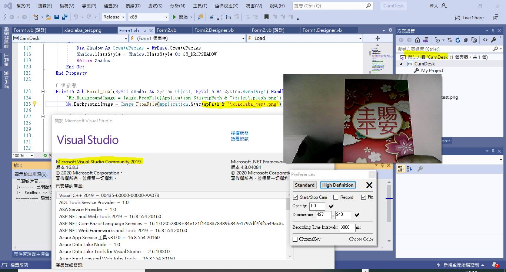

# camdesk_1.2.1
clone https://sourceforge.net/projects/camdesk/files/1.2/camdesk-1.2.1-vb-source.zip/download  

error when startup, no splash, fix by own, compile on the own
supply xiaolaba_test.png in project folder, copy to app release folder
```
        'Me.BackgroundImage = Image.FromFile(Application.StartupPath & "\files\splash.png")
        Me.BackgroundImage = Image.FromFile(Application.StartupPath & "\xiaolaba_test.png"
```



own copy of camdesk.exe  
[app.publish\CamDesk.exe](app.publish\CamDesk.exe)  
